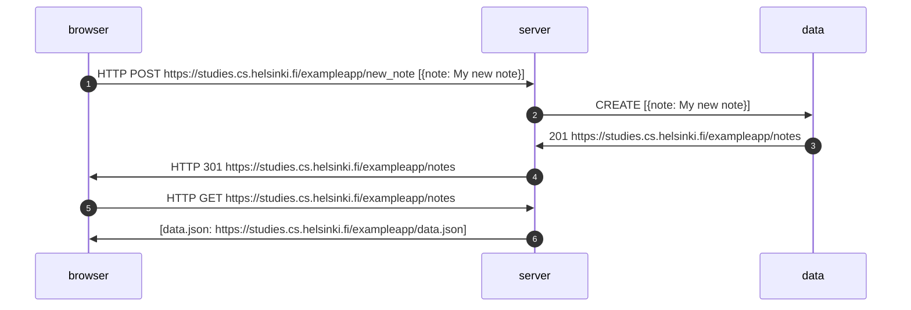
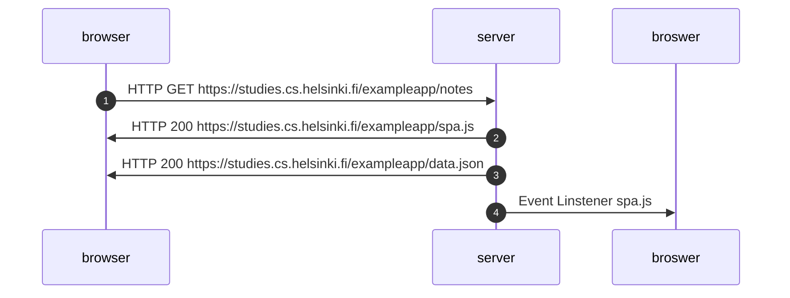
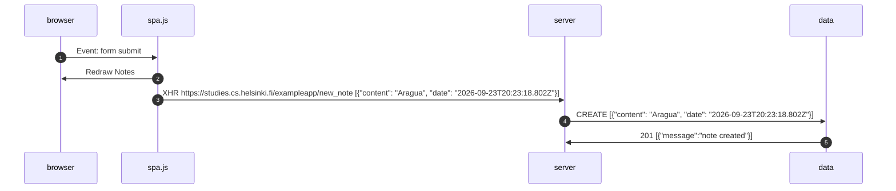

# Exercises List
## 0.1 HTML Tutorial
https://developer.mozilla.org/es/docs/Learn_web_development/Getting_started/Your_first_website/Creating_the_content

## 0.2 CSS Tutorial
https://developer.mozilla.org/es/docs/Learn_web_development/Getting_started/Your_first_website/Styling_the_content

## 0.3 HTML Forms
https://developer.mozilla.org/es/docs/Learn_web_development/Extensions/Forms/Your_first_form

## 0.4 New Note's Diagram

## 0.5 SPA Diahgram

## 0.6 SPA Diahgram
